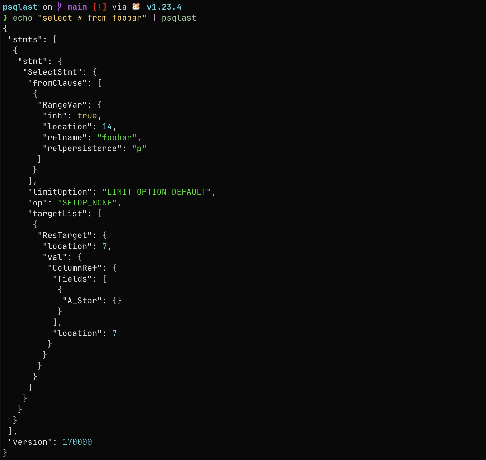
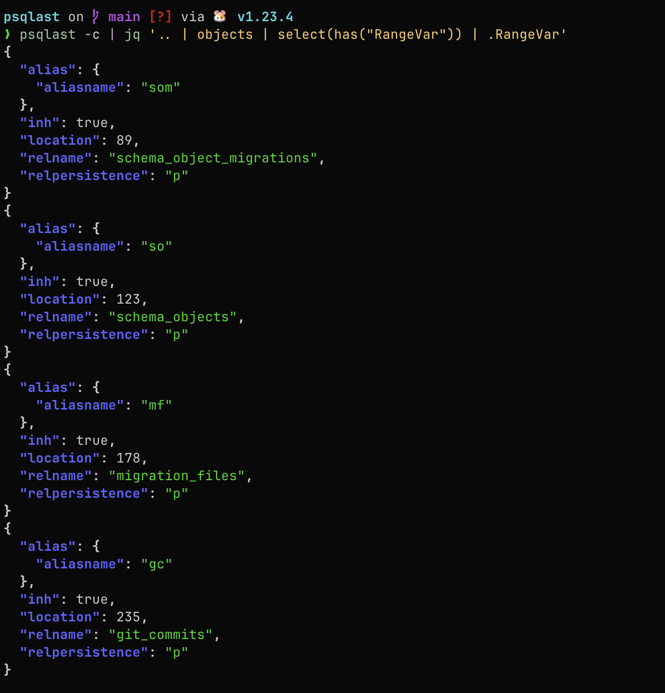
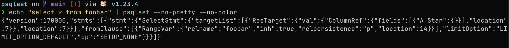

# psqlast -- view the AST for your postgres scripts

This Go program reads an SQL script and converts it to JSON using [**pg_query**](https://github.com/pganalyze/pg_query_go). It supports:

- **File** input (by specifying a path as a positional argument)
- **STDIN** input (when no file is given)
- **Clipboard** input (via `--use-clipboard` or `-c`)
- **Pretty-printing** and indentation (`--no-pretty` to disable, `--indent` for specifying spaces or tab)
- **Colorized JSON** output (`--no-color` to disable)
- **Output** to a specified file (`--out=FILE`) or STDOUT by default

## Features

1. **SQL** → **JSON** using [github.com/pganalyze/pg_query_go/v6](https://github.com/pganalyze/pg_query_go).
2. **Clipboard** support with [github.com/atotto/clipboard](https://github.com/atotto/clipboard).
3. **Colorized** output using [github.com/TylerBrock/colorjson](https://github.com/TylerBrock/colorjson).

## Installation

```bash
go install github.com/tylergannon/psqlast@latest
```
this will install `psqlast` to your `$GO_HOME/bin` directory.


## Examples

### Normal formatted output

```fish
echo "select * from foobar" | psqlast

# also, if the query is in your clipboard:

echo (pbpaste) | psqlast

# or, more simply:

psqlast -c
```


### Use [https://jqlang.github.io/jq/](jq) to process the data:

#### Select all table references from a query

```fish
psqlast -c | jq '.. | objects | select(has("RangeVar")) | .RangeVar'
```




### No formatting:

```fish
echo "select * from foobar" | psqlast --no-pretty --no-color
```



## License

Distributed under the MIT License.

## Contributing

Feel free to open an issue or pull request to contribute improvements or fixes.
